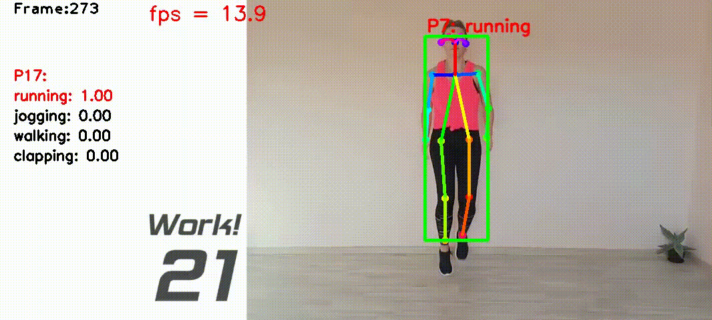
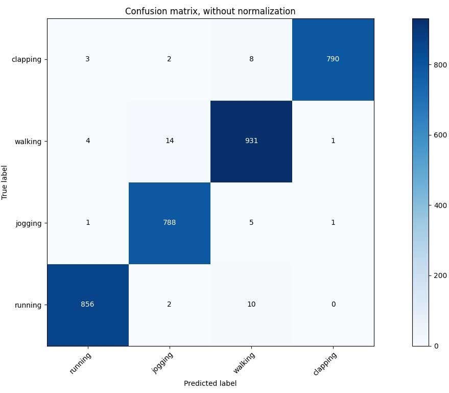

# Multi-person Real-time Action Recognition Based-on Human Skeleton




**Highlights**: 
4 actions; multiple people (<=5); Real-time and multi-frame based recognition algorithm.

**Updates**: On 2021-05-10, I refactored the code; added more comments; and put all settings into the [config/config.yaml](config/config.yaml) file, including: classes of actions, input and output of each file, OpenPose settings, etc. 

**Project**: This is my final project for human action recognition based on video data has diverse applications in Kocaeli University on May 2021. I worked on is [here](https://github.com/felixchenfy/Realtime-Action-Recognition).

**Warning:** Since I used the 10 fps video and 0.5s-window for training, you must also limit your video fps to be about 10 fps (7~12 fps) if you want to test my pretrained model on your own video or web camera. 

**Contents:**
- [1. Algorithm](#1-algorithm)
- [2. Install Dependency (OpenPose)](#2-install-dependency--openpose-)
- [3. Program structure](#3-program-structure)
  * [Diagram](#diagram)
  * [Main scripts](#main-scripts)
- [4. How to run: Inference](#4-how-to-run--inference)
  * [Introduction](#introduction)
  * [Test on video file](#test-on-video-file)
  * [Test on a folder of images](#test-on-a-folder-of-images)
  * [Test on web camera](#test-on-web-camera)
- [5. Training data](#5-training-data)
  * [Download my data](#download-my-data)
  * [Data format](#data-format)
  * [Classes](#classes)
- [6. How to run: Training](#6-how-to-run--training)
- [7. Result and Performance](#7-result-and-performance)


# 1. Algorithm

I collected videos of 4 Types of actions: `['running', 'jogging', 'walking', 'clapping']`. The total video lengths are about 20 mins, containing about 10000 video frames recorded at 10 frames per second.

The workflow of the algorithm is:
*  Get the joints' positions by [OpenPose](https://github.com/ildoonet/tf-pose-estimation).
*  Track each person. Euclidean distance between the joints of two skeletons is used for matching two skeletons. 
See `class Tracker` in [lib_tracker.py](utils/lib_tracker.py)
*  Fill in a person's missing joints by these joints' relative pos in previous frame.  See `class FeatureGenerator` in [lib_feature_proc.py](utils/lib_feature_proc.py). So does the following.
*  Add noise to the (x, y) joint positions to try to augment data.
*  Use a window size of 0.5s (5 frames) to extract features.    
*  Extract features of (1) body velocity and (2) normalized joint positions and (3) joint velocities.
*  Apply PCA to reduce feature dimension to 80.  Classify by DNN of 3 layers of 50x50x50 (or switching to other classifiers in one line). See `class ClassifierOfflineTrain` in [lib_classifier.py](utils/lib_classifier.py)
*  Mean filtering the prediction scores between 2 frames. Add label above the person if the score is larger than 0.8. See `class ClassifierOnlineTest` in [lib_classifier.py](utils/lib_classifier.py)

For more details about how the features are extracted, please see my [report](doc/presentation.pdf).

# 2. Install Dependency (OpenPose)

First, Python >= 3.6.

I used the OpenPose from this Github: [tf-pose-estimation](https://github.com/ildoonet/tf-pose-estimation). First download it:

```
export MyRoot=$PWD
cd src/githubs  
git clone https://github.com/ildoonet/tf-pose-estimation  
```

Follow its tutorial [here](https://github.com/ildoonet/tf-pose-estimation#install-1) to download the "cmu" model. As for the "mobilenet_thin", it's already inside the folder.  

```
$ cd tf-pose-estimation/models/graph/cmu  
$ bash download.sh  
```

Then install dependencies. I listed my installation steps as bellow:
```
conda create -n tf tensorflow-gpu
conda activate tf

cd $MyRoot
pip install -r requirements.txt
pip install jupyter tqdm
pip install tensorflow-gpu==1.13.1
sudo apt install swig
pip install "git+https://github.com/philferriere/cocoapi.git#egg=pycocotools&subdirectory=PythonAPI"

cd $MyRoot/src/githubs/tf-pose-estimation/tf_pose/pafprocess
swig -python -c++ pafprocess.i && python3 setup.py build_ext --inplace
```

Make sure you can successfully run its demo examples:
```
cd $MyRoot/src/githubs/tf-pose-estimation
python run.py --model=mobilenet_thin --resize=432x368 --image=./images/p1.jpg
```

# 3. Program structure

## Confusion Matrix



## Main scripts
The 5 main scripts are under `src/`. They are named under the order of excecution:
```
src/run1_get_skeletons_from_training_imgs.py    
src/run2_put_skeleton_txts_to_a_single_txt.py
src/run3_preprocess_features.py
src/run4_train.py 
src/run5_result.py
```

The input and output of these files as well as some parameters are defined in the configuration file [config/config.yaml](config/config.yaml). I paste part of it below just to provide an intuition:

``` yaml
classes: ['running', 'jogging', 'walking', 'clapping']

image_filename_format: "{:05d}.jpg"
skeleton_filename_format: "{:05d}.txt"

features:
  window_size: 5 # Number of adjacent frames for extracting features. 

run1_get_skeletons_from_training_imgs.py:
  openpose:
    model: cmu # cmu or mobilenet_thin. "cmu" is more accurate but slower.
    img_size: 656x368 #  656x368, or 432x368, 336x288. Bigger is more accurate.
  input:
    images_description_txt: data/valid_images.txt
    images_folder: data/
  output:
    images_info_txt: data_skel/raw_skeletons/images_info.txt # This file is not used.
    detected_skeletons_folder: &skels_folder data_skel/raw_skeletons/skeleton_res/
    viz_imgs_folders: data_skel/raw_skeletons/image_viz/

run2_put_skeleton_txts_to_a_single_txt.py:
  input:
    # A folder of skeleton txts. Each txt corresponds to one image.
    detected_skeletons_folder: *skels_folder
  output:
    # One txt containing all valid skeletons.
    all_skeletons_txt: &skels_txt data_skel/raw_skeletons/skeletons_info.txt

run3_preprocess_features.py:
  input: 
    all_skeletons_txt: *skels_txt
  output:
    processed_features: &features_x data_skel/features_X.csv
    processed_features_labels: &features_y data_skel/features_Y.csv

s4_train.py:
  input:
    processed_features: *features_x
    processed_features_labels: *features_y
  output:
    model_path: model/trained_classifier.pickle
```

For how to run the main scripts, please see the Section `4. How to run: Inference` and `6. How to run: Training`.

# 4. How to run: Inference

## Introduction
The script [src/run5_result.py](src/run5_result.py) is for doing real-time action recognition. 


The classes are set in [config/config.yaml](config/config.yaml) by the key `classes`.

The supported input includes **video file**, **a folder of images**, and **web camera**, which is set by the command line arguments `--data_type` and `--data_path`.

The trained model is set by `--model_path`, e.g.:[model/trained_classifier.pickle](model/trained_classifier.pickle).

The output is set by `--output_folder`, e.g.: output/.

The test data (a video, and a folder of images) are already included under the [data_videos/](data_videos/) folder.

An example result of the input video "exercise.avi" is:

```
output/exercise/
├── skeletons
│   ├── 00000.txt
│   ├── 00001.txt
│   └── ...
└── video.avi
```
Also, the result will be displayed by cv2.imshow().

Example commands are given below:

## Test on video file
``` bash
python src/run5_result.py \
    --model_path model/trained_classifier.pickle \
    --data_type video \
    --data_path data_videos/exercise.avi \
    --output_folder output
```

## Test on a folder of images
``` bash
python src/run5_result.py \
    --model_path model/trained_classifier.pickle \
    --data_type folder \
    --data_path data_videos/testing/ \
    --output_folder output
```

## Test on web camera
``` bash
python src/run5_result.py \
    --model_path model/trained_classifier.pickle \
    --data_type webcam \
    --data_path 0 \
    --output_folder output
```

# 5. Training data


## Download my data
Follow the instructions in [data/download_link.md](data/download_link.md) to download the data. Or, you can create your own. The data and labelling format are described below.

## Data format

Each data subfolder (e.g. `data/jump_03-02-12-34-01-795/`) contains images named as `00001.jpg`, `00002.jpg`, etc.   
The naming format of each image is defined in [config/config.yaml](config/config.yaml) by the sentence: `image_filename_format: "{:05d}.jpg"`.

The images to be used as training data and their label are configured by this txt file: [data/valid_images.txt](data/valid_images.txt).  
A snapshot of this txt file is shown below:
```
running_03-13-11-27-50-720
52 59
72 79

jogging_03-02-12-34-01-795
54 62
```
In each paragraph,  
the 1st line is the data folder name, which should start with `"${class_name}_"`. 
The 2nd and following lines specify the `staring index` and `ending index` of the video that corresponds to that class.

Let's take the 1st paragraph of the above snapshot as an example: `running` is the class, and the frames `52~59` & `72~79` of the video are used for training.

## Classes

The classes are set in [config/config.yaml](config/config.yaml) under the key word `classes`. No matter how many classes you put in the training data (set by the folder name), only the ones that match with the classes in **config.yaml** are used for training and inference.

# 6. How to run: Training

First, you may read
* Section `5. Training data`
* Section `3. Program structure`
* [config/config.yaml](config/config.yaml)

to know the training data format and the input and output of each script.

Then, follow the following steps to do the training:
* Collect your own data and label them, or use the data. [Here](https://github.com/felixchenfy/record_images_from_usbcam) is tool to record images from web camera.
* If you are using your data, change the values of `classes` and `images_description_txt` and `images_folder` inside [config/config.yaml](config/config.yaml).
* Depend on your need, you may change parameters in [config/config.yaml](config/config.yaml).
* Finally, run the following scripts one by one:
    ``` bash
    python src/run1_get_skeletons_from_training_imgs.py
    python src/run2_put_skeleton_txts_to_a_single_txt.py 
    python src/run3_preprocess_features.py
    python src/s4_train.py 
    ```

By default, the intermediate data are saved to [data_skel/](data_skel/), and the model is saved to [model/trained_classifier.pickle](model/trained_classifier.pickle).  
After training is done, you can run the inference script `src/run5_result.py` as described in 